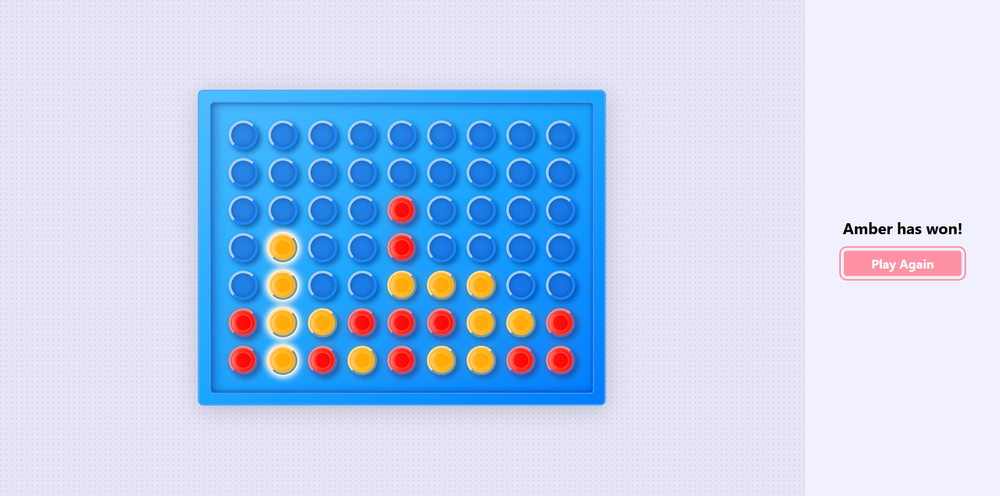

# Connect 4 Game

A modern implementation of the classic Connect 4 game built with *React* and *Vite*, featuring a sleek design and smooth animations.

🎮 [Play the game here!](https://andryalexis.github.io/Connect-4)

 <!-- Consider adding a screenshot of your game -->

## Features

- 🎮 Classic Connect 4 gameplay mechanics
- 🎨 Modern UI with smooth animations and 3D effects
- ✨ Victory celebration with confetti animation
- 🎯 Win detection in all directions (horizontal, vertical, diagonal)

## Technical Highlights

- Built with React 18 and Vite for optimal performance
- Tailwind CSS for styling with custom animations
- Component-based architecture for maintainability
- ESLint configuration for code quality
- Prop-types for component documentation and type checking

## Game Components

The game is built with several key components:

- **Board**: Main game container with win detection logic
- **Column**: Handles token placement and click events
- **Row**: Represents individual cells with 3D visual effects
- **Token**: Player tokens with distinct colors

## Getting Started

1. Clone the repository
2. Install dependencies:
